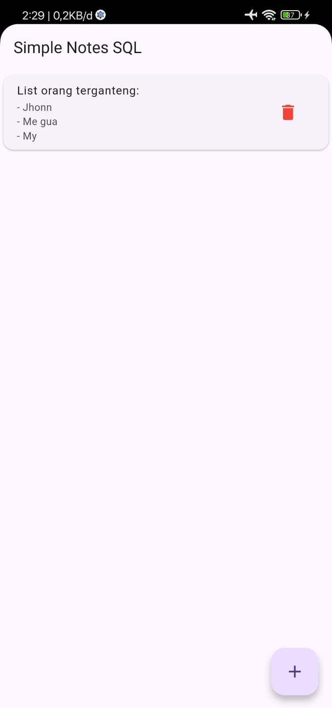
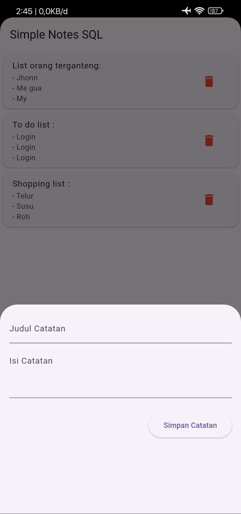

# Simple Notes SQL 📝

Aplikasi catatan sederhana (Simple Note App) yang dibangun menggunakan **Flutter** dan **SQLite** (Local Database). 

Project ini dibuat untuk menyelesaikan tugas **Week 9 - Mobile Programming**. Aplikasi ini memungkinkan pengguna untuk menyimpan catatan secara permanen di dalam perangkat (local storage), sehingga data tidak hilang meskipun aplikasi ditutup.

## 📱 Tampilan Aplikasi



## 🔥 Fitur Utama (CRUD)

Sesuai instruksi tugas, aplikasi ini memiliki fitur:

* ✅ **Create:** Menambahkan catatan baru (Judul & Isi) ke database.
* ✅ **Read:** Menampilkan daftar semua catatan yang tersimpan di SQLite.
* ✅ **Delete:** Menghapus catatan dari list dan database secara permanen.
* 💾 **Local Storage:** Menggunakan `sqflite` untuk penyimpanan data offline.

## 🛠️ Teknologi yang Digunakan

* **Language:** Dart
* **Framework:** Flutter
* **Database:** SQLite
* **Dependencies:**
    * [`sqflite`](https://pub.dev/packages/sqflite): ^2.3.0 (Untuk manajemen database SQLite)
    * [`path`](https://pub.dev/packages/path): ^1.9.0 (Untuk mengatur lokasi penyimpanan database)

## 📂 Struktur Project

* `lib/models/note_model.dart`: Model data untuk konversi Map <-> Object.
* `lib/database/database_helper.dart`: Mengatur koneksi database dan query SQL (Singleton Pattern).
* `lib/main.dart`: User Interface (UI) untuk menampilkan list dan form input.

## 🚀 Cara Menjalankan Aplikasi

**Penting:** Aplikasi ini menggunakan database lokal (`sqflite`), sehingga **TIDAK MENDUKUNG** dijalankan di Web (Chrome/Edge). Harap jalankan di **Android Emulator** atau **Device Fisik**.

1.  **Clone Repository:**
    ```bash
    git clone https://github.com/str122-xyz/Task-Week-9-1123150070.git
    ```

2.  **Install Dependencies:**
    Masuk ke folder project dan jalankan:
    ```bash
    flutter pub get
    ```

3.  **Run Aplikasi:**
    Pastikan Emulator sudah nyala atau HP sudah tercolok.
    ```bash
    flutter run
    ```

---
**NIM** 1123150070
**Created by:** Satria Herlambang